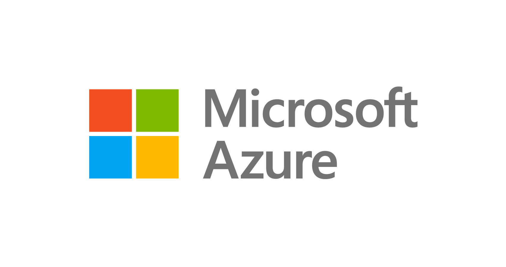

# Table des matières

- API
- VM
- DNS
- Démo
- Questions

<!-- end_slide -->

# API


<!-- end_slide -->

# VM


## Configuration tirée du support de cours.
- VM Linux Ubuntu 24.04,
- Standard B2ts v2: 2 vCPU, 1 Gio RAM,
- Ports 22, 80, 443 ouverts.

<!-- end_slide -->

# DNS


<!-- end_slide -->

# Démo
===

## Enregistrement d'un utilisateur

```bash +exec
curl -X POST https://motd.cstef.dev/auth/register \
  -H "Content-Type: application/json" \
  -d '{"username": "alice", "password": "secret123"}'
```

<!-- end_slide -->

## Connexion

```bash +exec
curl -X POST https://motd.cstef.dev/auth/login \
  -H "Content-Type: application/json" \
  -d '{"username": "alice", "password": "secret123"}'
```

<!-- end_slide -->

## Création d'un post

```bash +exec
curl -X POST https://motd.cstef.dev/posts \
  -H "Content-Type: application/json" \
  -H "Authorization: Bearer YOUR_JWT_TOKEN" \
  -d '{"content": "hello world!"}'
```
<!-- end_slide -->

## Modification d'un post

```bash +exec
curl -X PUT https://motd.cstef.dev/posts/1 \
  -H "Content-Type: application/json" \
  -H "Authorization: Bearer YOUR_JWT_TOKEN" \
  -d '{"content": "hello modified world!"}'
```
<!-- end_slide -->

## Récupération des posts

```bash +exec
curl https://motd.cstef.dev/posts
```
<!-- end_slide -->

## Suppression d'un post

```bash +exec
curl -X DELETE https://motd.cstef.dev/posts/1 \
  -H "Authorization: Bearer YOUR_JWT_TOKEN"
```
<!-- end_slide -->
# Questions